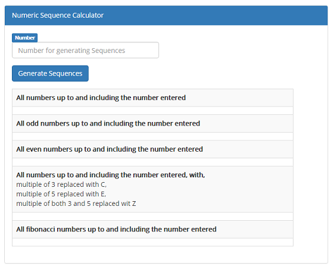
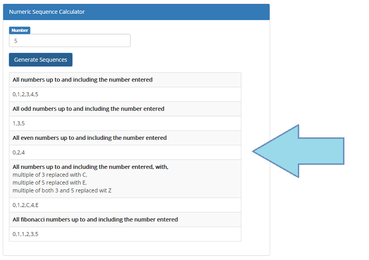
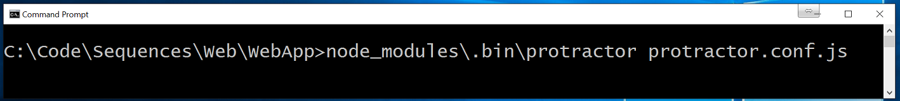
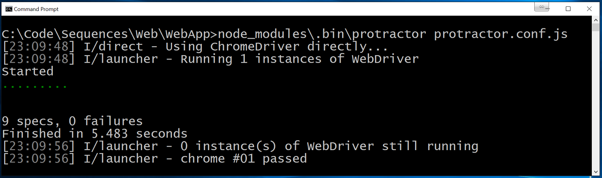
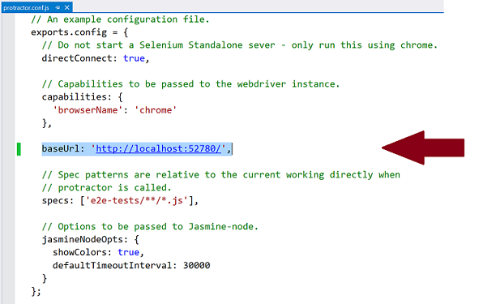

# Numeric Sequence Calculator

## Overview
A web-based solution that let's user enter positive whole number and initiate the calculation of numeric
sequences. Following numeric sequences are calculated and displayed:

1. All numbers up to and including the number entered
2. All odd numbers up to and including the number entered
3. All even numbers up to and including the number entered
4. All numbers up to and including the number entered, except when
    - A number is a multiple of 3 output C, and when,
    - A number is a multiple of 5 output E, and when,
    - A number is a multiple of both 3 and 5 output Z
5. All fibonacci numbers up to and including the number entered

## Running the Application
The application has been developed in Visual Studio 2013 using AngularJS for Front-End and Asp&#46;Net Web API 2.0 (C#) as Back-End. Below are the steps for running the application.

1. [Clone](https://help.github.com/articles/cloning-a-repository/) the repository to create a local copy on your computer.
2. Open **Sequences** Solution in Visual Studio.
3. Build the solution through Visual Studio. This will restore all NuGet packages during the build.
4. Select the project **Web** and press (CTRL+F5). This will open following page. 
6. Enter a Positive Whole **Number** and press **Generate Sequences**. *Error messages will be shown if invalid number is entered and no sequence would be generated.*
7. Numeric sequences will be calculated and results will be shown as below.

## Running Tests

### Unit Tests

Unit tests are implemented using MSTest and are part of the **UnitTests** project. These tests can be run using the Test Explorer within Visual Studio. For more details, please visit [How to: Run Tests from Microsoft Visual Studio](https://msdn.microsoft.com/en-us/library/ms182470(v=vs.120).aspx) 

### EndToEnd UI Tests
EndToEnd tests for AngularJS are implementing using [Protractor](http://www.protractortest.org/) framework. Following are important dependencies for running these tests.

- [Node&#46;js](https://nodejs.org/en/)
- [Protractor](http://www.protractortest.org/)
- [Google Chrome Browser](https://www.google.com/chrome/)
- [Java] (https://java.com/en/download/) (*if using selenium webdriver*)
- Either Application running at **http&#58;<spam></spam>&#47;<spam></spam>&#47;localhost&#58;52780&#47;** or **baseUrl** is updated with Application port within **<spam>protractor&#46;</spam>conf&#46;<spam>js</spam>** file

#### Running UI Tests
Three important components for running UI tests are located under **Sequences > Web > WebApp**

1. Folder **e2e-tests** with UI Test Scenarios
2. Protractor configuration file **protractor&#46;conf&#46;js**
3. Folder **node_modules\\.bin** with Executables to run these tests 

##### How to run

1. Ensure *Web* is running in *IISExpress* at **localhost&#58;52780**
2. run command prompt as administrator
3. change directory to *Sequences\Web\WebApp*
4. Enter the command `node_modules\.bin\protractor protractor.conf.js` 
5. **Allow access** if there are any *Windows Firewall* Security Alerts
6. Protractor will run the UI tests in Chrome browser
7. Test Results will be shown in the command prompt 

#### Updating Application URL in Protractor configurations file

Protractor configuration file that is part of current solution, requires the application to run at **http&#58;<spam></spam>&#47;<spam></spam>&#47;localhost&#58;52780&#47;**. If Application is running on a different URL or Port, the value of **baseUrl** should be updated in Protractor configuration file located at *Sequences\Web\WebApp\protractor&#46;conf&#46;<spam>js</spam>* 

